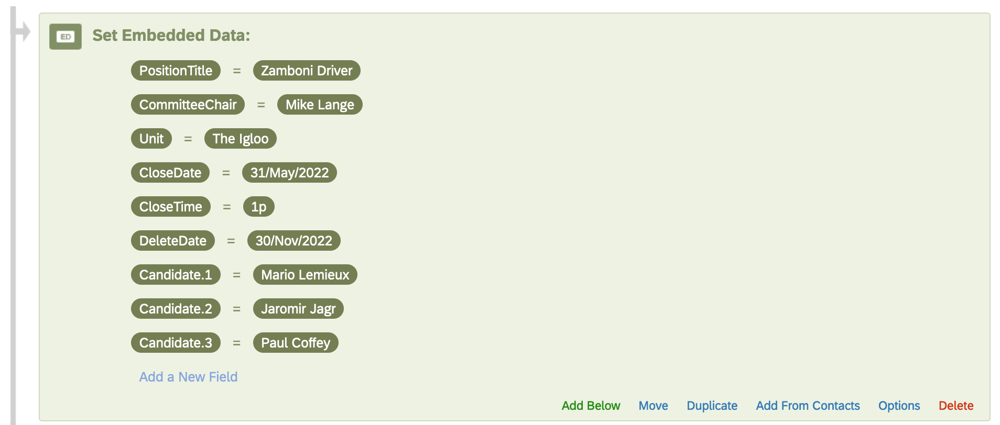

# Advanced Candidate Evaluation: Setup

[Import & Export Qualtrics
Surveys](https://www.qualtrics.com/support/survey-platform/survey-module/survey-tools/import-and-export-surveys/)
[File Upload Question for a Qualtrics
Surveys](https://www.qualtrics.com/support/survey-platform/survey-module/editing-questions/question-types-guide/advanced/file-upload/)

## Embedded Data

The embedded data contains the modifiable variables within the survey.
These variables need to be set for each search. The ***PositionTitle***
and ***Unit*** are the title and unit, respectively, used in the
original posting.

| Variable Name | Description |
|:--:|:---|
| PositionTitle | The title of the position |
| CommitteeChair | The name of the Search Committee Chair |
| Unit | The name of the unit searching for the position |
| CloseDate | Date the evaluation (aka survey) closes |
| CloseTime | Time the evaluation (aka survey) closes |
| DeleteDate | Date the Qualtrics survey and data will be deleted |
| Candidate\_#: | The name of the candidate. Replace the **\#** symbol with a cardinal number. There can be as many candidates as needed. See example below. |

*NB*: Do not use special characters like emojis, periods (.), dollar
signs (\$), and hashtags (#) when naming your embedded data variables.
See [Qualtric’s webpage on Best Practices and Troubleshooting Embedded
Data](https://www.qualtrics.com/support/survey-platform/survey-module/survey-flow/standard-elements/embedded-data/#BestPractices)
for more information about embedded data.

The Embedded Data options

It is possible to remove (delete) an embedded data variable and is
sometimes needed when changing the number of candidates. To delete an
embedded variable:

- Click on the embedded variable name, *e.g.*, “Candidate.3”
- Delete all the text until the cursor is at the left-most side of the
  text box and no characters are present
- Press the “Delete” key (aka Backspace key, the one above the
  Enter/Return key or the Backslash ( \\ ) and Pipe ( \| ) key one more
  time to delete embedded variable
- The cursor will move to the end of the above, defined embedded
  variable
- Click outside of the text box to stop making changes
- Click the **Apply** button in the lower right corner
