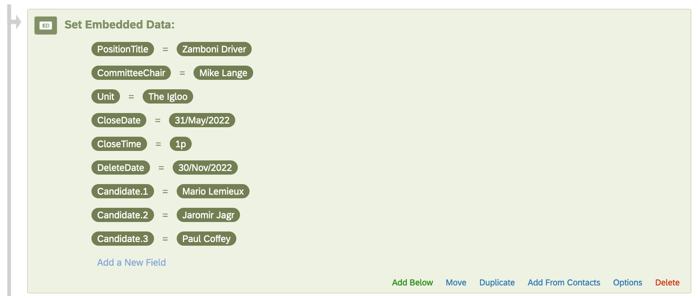

```{r setup, include = FALSE}
knitr::opts_chunk$set(
	echo=FALSE,
	message=FALSE,
	warning=FALSE)
```


The purpose of Advanced Candidate Evaluation (ACE) is to reduce the amount of time and resources needed to construct informative and insightful candidate evaluations. Often, candidate evaluations are conducted using a Google Form, Microsoft Form, or a Qualtric survey that is completed by those interacting with the candidates. The results are downloaded and provided to the search committee to aid their evaluation of the candidates and make a more informed decision. Unfortunately, the noted means of collecting information from those outside the search committee are often sub-optimal with no checks-and-balances on those submitting comments (lack of accountability and ability to submit multiple evaluations) and minimal means of creating a formal report. _It cannot be stressed enough that all comments are confidential and the search committee never has access to the original, identified Qualtrics data. Well, unless one of them is administering the evaluation survey. But this is why you have someone **outside** the committee administer the survey._

ACE was built to ensure evaluator confidentiality through the implementation of an administrator not associated with the search committee. Additionally, the analysis of the evaluations identifies multiple entries by a single individual and retains only the last set of responses. Respondents are notified on the Introduction page to contact the ACE administrator if they are submitting multiple responses for a single candidate and the ability for the analysis to merge their responses into a single response is possible. The automatic merging of multiple responses is not the default behaviour though we are looking into ways to ensure the merging is correct.

The result is a set of [bespoke reports](ADD LINK); an individual report for each candidate along with a comparative executive summary comparing the candidates. The option to include a breakdown of the evaluators' MAUs and job titles is being developed. 


## Workflow

A standardized interview candidate evaluation instrument containing a [collection of questions](AdvancedCandidateEvaluation_questions.html) that can be augmented to include position-specific questions. The Advanced Candidate Evaluation (ACE) has the sections:

- Introduction
- Authentication
- Questions
  - About the Respondent
  - Select the Candidates
  - Questions about the Candidate
    - Meeting the Candidate
    - The Candidate's Presentation
    - Questions about the Candidate

{width=100%}


## Timeline

One of ACE's goals is to make candidate evaluations easier to manage, and thus, faster to setup and evaluate. 

Depending on the amount of modifications to the initial set of questions, setting up the Qualtrics survey takes about one to two hours. The analysis of the responses can take between a few hours and a day depending on the amount of customization needed to address unexpected difficulties. 

To ensure everything works smoothly, please include your ACE administrator on emails regarding when the final round of interviews will take place and when the search committee will need the summarised evaluations and are meeting to discuss the candidates. Keeping the ACE administrator informed of when specific items are needed will ensure everything gets done in a timely fashion.

## Embedded Data

The embedded data contains the modifiable variables within the survey. These variables need to be set for each search. The _**PositionTitle**_ and _**Unit**_ are the title and unit, respectively, used in the original posting. 

| Variable Name | Description |
|:-------------:|:-----------------------------|
| PositionTitle | The title of the position |
| CommitteeChair | The name of the Search Committee Chair |
| Unit | The name of the unit searching for the position |
| CloseDate | Date the evaluation (aka survey) closes |
| CloseTime | Time the evaluation (aka survey) closes |
| DeleteDate | Date the Qualtrics survey and data will be deleted |
| Candidate_#: | The name of the candidate. Replace the **#** symbol with a cardinal number. There can be as many candidates as needed. See example below. |

_NB_: Do not use special characters like emojis, periods (.), dollar signs ($), and hashtags (#) when naming your embedded data variables. See [Qualtric's webpage on Best Practices and Troubleshooting Embedded Data](https://www.qualtrics.com/support/survey-platform/survey-module/survey-flow/standard-elements/embedded-data/#BestPractices) for more information about embedded data.

{width=100%}

It is possible to remove (delete) an embedded data variable and is sometimes needed when changing the number of candidates. To delete an embedded variable:

- Click on the embedded variable name, _e.g._, "Candidate.3"
- Delete all the text until the cursor is at the left-most side of the text box and no characters are present
- Press the "Delete" key (aka Backspace key, the one above the Enter/Return key or the Backslash ( \\ ) and Pipe ( | ) key one more time to delete embedded variable
- The cursor will move to the end of the above, defined embedded variable
- Click outside of the text box to stop making changes
- Click the **Apply** button in the lower right corner

