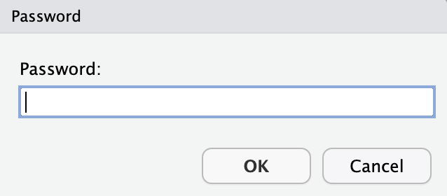
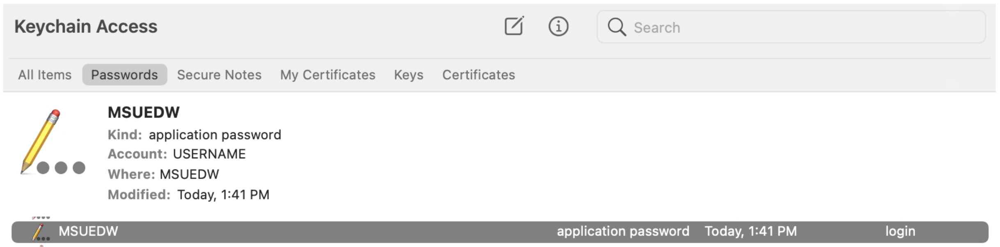
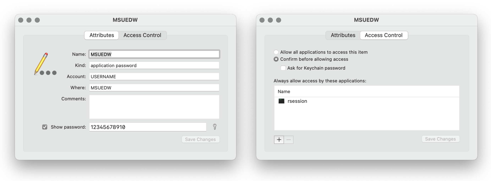

## Accessing MSUEDW Data using `R`

While the Oracle SQL Developer is a nice application for exploring the available data, and [dBeaver Community](https://dbeaver.io) is even better, why use one application to access and download and another to analyze the data? The following `R` code examples and snippets provide a collection of common MSUEDW data pulls and merges done entirely in `R`. We believe off-loading filters and merges to a locol machine reduces the load on the SQL server. _NB: We commonly -- and encourage -- the use dBeaver of **explore** the various Views/Tables within the EDW to explore the contained data and determine the fields of interest. Additionally, we use dBeaver to determine fields to restrict data pulls._

The following documentation is segmented into sections based on specific actions. 

<!-- Click here for an `R` file with the settings and an example snippet. -->


## Download and Install the Oracle Database JDBC driver and Companion Jars Downloads

Visit the [Oracle Database JDBC driver and Companion Jars Downloads](https://www.oracle.com/database/technologies/appdev/jdbc-downloads.html) page and download the [Zipped JDBC driver (ojdbc11.jar) and Companion Jars ](https://download.oracle.com/otn-pub/otn_software/jdbc/218/ojdbc11-full.tar.gz) file.

The following instructions are for installation on macOS (version 11 or newer). Similar steps should work on Linux and Windows.


### Command Line Install

Within your `home` directory (aka folder) create a `software` directory. Move the `ojdbc11-full.tar.gz` file into the `software` and unzip the file. The easiest way to accomplish this is via the macOS Terminal. When downloading the `ojdbc11-full.tar.gz` file you were likely given the option where to save it. Please save it to the `Downloads` directory.

```shell
emilio@iMac ~ % mkdir -p software
emilio@iMac ~ % cd software
emilio@iMac software % tar zxvf ~/Downloads/ojdbc11-full.tar.gz
emilio@iMac software % cd ojdbc11-full
emilio@iMac ojdbc11-full % ls
Javadoc-Readmes    ojdbc.policy      ojdbc11dms_g.jar   osdt_cert.jar    ucp11.jar
LICENSE.txt        ojdbc11.jar       ons.jar            osdt_core.jar    xdb.jar
README.txt         ojdbc11_g.jar     oraclepki.jar      rsi.jar          xmlparserv2.jar
dms.jar            ojdbc11dms.jar    orai18n.jar        simplefan.jar    xmlparserv2_sans_jaxp_services.jar
```

### Install Via the File Viewer

Open a macOS finder window and ensure you are in your `home` directory.

  - Create a folder called “software”
  - Copy (or move) the `ojdbc11-full.tar.gz` file to the `software` folder
  - Double click the `ojdbc11-full.tar.gz` file to unzip the file


### Location of the OJDBC Jar File

The location (aka complete path) of the `ojdbc11.jar` file is needed to set the `classPath` variable for the `RJDBC::JDBC()` function within the `R` script below. For my installation, the `classPath` is `/Users/emilio/software/ojdbc11-full/ojdbc11.jar`
                          

## Install Java- and SQL-specific `R` Packages

The following packages are needed to access the MSUEDW SQL server. They only need to be installed once, but if you upgrade your `R` instance, you might need to reinstall these packages. The [`DBI`](https://cran.r-project.org/package=rJava), [`rJava`](https://cran.r-project.org/package=DBI), and [`RJDBC`](https://cran.r-project.org/package=RJDBC) packages allow `R` to connect to the Oracle database, while [`keyring`](https://cran.r-project.org/package=keyring) safely stores your password. The [`tidyverse`](https://www.tidyverse.org/) is a collection of `R` packages designed to streamline and make data analysis easier. 

Open **RStudio** and enter the following command in the **Console**.

```
install.packages("DBI", "rJava", "RJDBC", "keyring", "tidyverse")
```


## Save Your Password in Your Secure Keyring

The [`keyring::key_set()`](https://r-lib.github.io/keyring/reference/key_get.html) function prompts the user to enter their password. The ability to have the `R` session interact with [macOS Keychain keyring](https://r-lib.github.io/keyring/reference/backend_macos.html), [Windows Credential Store keyring](https://r-lib.github.io/keyring/reference/backend_wincred.html) or [Linux Secret Service keyring](https://r-lib.github.io/keyring/reference/backend_secret_service.html) to obtain your password from a secure keyring. For additional information about keyrings on specific operating systems, please see the following:

 - Apple article on [What is Keychain Access on Mac?](https://support.apple.com/guide/keychain-access/what-is-keychain-access-kyca1083/mac)
 - Microsoft article on [Accessing Credential Manager](https://support.microsoft.com/en-us/windows/accessing-credential-manager-1b5c916a-6a16-889f-8581-fc16e8165ac0)
 - Linux manual page entry on [keyrings](https://man7.org/linux/man-pages/man7/keyrings.7.html)

Open **RStudio** and enter the following command in the **Console**. The following function stores your password in secure keyring of your operating system. Securely storing you password allows you to automate data pulls and script actions without including a password in the script. 

```r
keyring::key_set(service="MSUEDW", username="USERNAME")
```

After submitting the command, a password submission box opens. Enter your MSUEDW password and the "OK" button.

{width=40%}

The `keyring::key_set()` function creates a MSUEDW entry within the keyring, in this case for macOS. 

{width=100%}

Exploring the entry, you can see the service name (`MSUEDW`), account name (`USERNAME`), and the password (`1235567890`). The Access Control enables the need to notice require the keychain (or keyring) password to access the password for any `R` session.

{width=100%}

You can also retrieve the password using the `keyring::key_get()` command in the **RStudio Console**:

```r
keyring::key_get("MSUEDW","USERNAME")
[1] "12345678910"
```


## The `R` Script

The following describes the components of the `R` script used to interact with and download data from the MSUEDW. The script is segmented into components to facilitate easier explanations.


### Set Java Parameters

The first line of the `R` file instructs Java to clean up after itself and use a maximum amount of user specified memory (aka RAM).

```r
options(java.parameters = c("-XX:+UseConcMarkSweepGC", "-Xmx8192m"))
```

 - [Concurrent Mark Sweep (CMS) Collector](https://docs.oracle.com/javase/8/docs/technotes/guides/vm/gctuning/cms.html) for "shorter garbage collection pauses."
 - [Set the **maximum** memory heap size](https://docs.oracle.com/cd/E13150_01/jrockit_jvm/jrockit/geninfo/diagnos/memman.html)

Typically, we set the only the maximum memory heap size and set it at a value of ~ 8 Gb; `-Xmx8192m` or `-Xmx8g`. If your computer has more memory, feel free to increase the value. See the [-Xmx documentation](https://docs.oracle.com/cd/E13150_01/jrockit_jvm/jrockit/jrdocs/refman/optionX.html#wp999528) for additional information. _NB: From the `-Xmx` documentation, "`-Xmx` does not limit the total amount of memory that the JVM can use."_


### Load Required `R` Packages

Next, we load the packages needed to query the SQL server and filter and merge the results.

```r
library(DBI)
library(rJava)
library(RJDBC)
library(keyring)
library(tidyverse)
```


### Create Connection Driver

Create the JDBC connection drive using the `classPath` determined above. 

```r
jdbcDriver <- RJDBC::JDBC(driverClass="oracle.jdbc.OracleDriver", 
                          classPath="/Users/emilio/software/ojdbc11-full/ojdbc11.jar")
```


### Create Connection to MSUEDW

Create connection details for MSUEDW (details are found in the `tnsnames.ora` file). Remember to replace `"USERNAME"` with your username in _**both**_ places. Also, the general connection format is included along with MSUEDW specific function.

```r
# Connection format is:
# DBI::dbConnect(jdbcDriver, 
#                "jdbc:oracle:thin:@//database.hostname.com:port/service_name_or_sid", 
#                "username", "password")

MSUEDW.jdbc <- DBI::dbConnect(jdbcDriver, 
                              "jdbc:oracle:thin:@//ebsprd390d.ais.msu.edu:1521/MSUEDW.EBSP.MSU.EDU",
                              "USERNAME", 
                              keyring::key_get("MSUEDW","USERNAME"))
```

### Construct SQL Query

Construct the SQL query to be passed to the SQL server. The query can be basic or complex. This example is very basic and selects the first 10 lines from the `siscs.c_class_tbl_v` table (view). We gave the variable a very general name (`sql.query`), but using a more specific name is advisable when making multiple data pulls. For example, a possible name for this query is `sql.ClassTable` where the `sql` indicates the variable contains an SQL query and `ClassTable` indicate the query is to pull class table data.

```r
sql.query <- "select *
 from siscs.c_class_tbl_v
 where rownum <= 10"
```

### Send Query and Fetch Results

These two command sends the SQL query to the indicated SQL server (`dbSendQuery()`) and then fetches (aka downloads) the data (`dbFetch()`). The `query.data` variable contains the data resulting from your SQL query. Potentially better variable names include `ClassTable.results` and `ClassTable.data`, respectively. 

```r
query.results <- dbSendQuery(MSUEDW.jdbc, sql.query)
query.data <- dbFetch(query.results)
```

### Save the Data

Only save the data while excluding the `query.results`. It is prudent to retain the `sql.query` because it is possible that when reopening the data file, you do not have access to the original `R` script used to pull the data. This is common if you pull the data for a colleague or _vice versa_. Additionally, saving the `query.results` will cause errors when reading in the data file if the `DBI` package is not loaded. 

```r
save(list=c("sql.query", "query.data"),
     file="SQL_data.RData")
```


### Close the JDBC Connection

Remember to clean up when done by closing the database connection.

```r
DBI::dbDisconnect(MSUEDW.jdbc)
```

