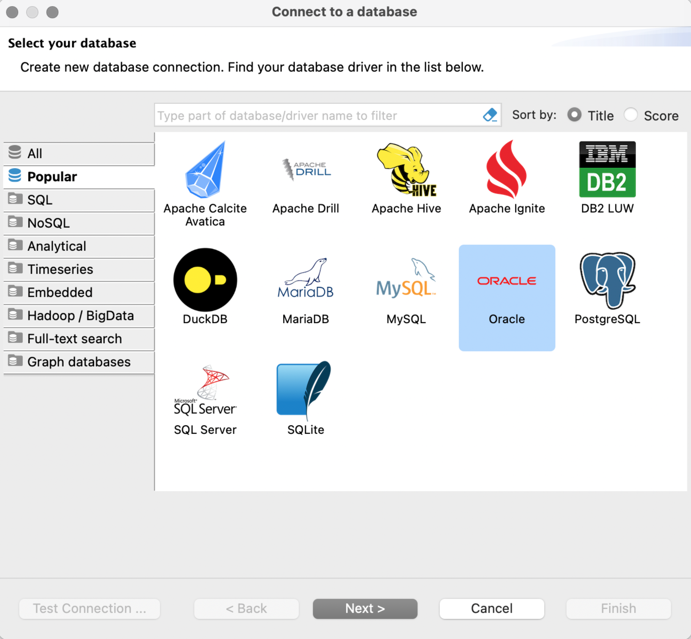
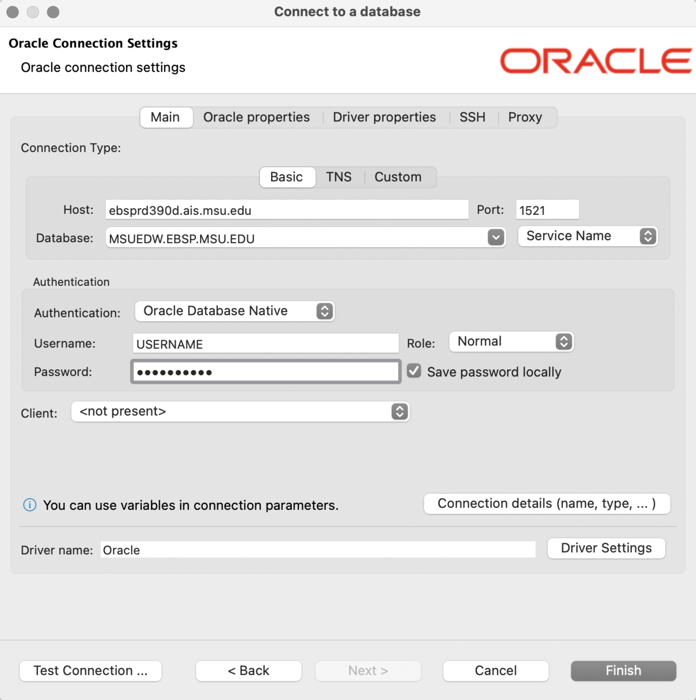

**_FERPA Disclaimer Statement_**

> **IMPORTANT NOTE**: You are solely responsible for the maintenance of the confidentiality of this information as established in the Family Educational Rights and Privacy Act (FERPA) and Michigan State University Guidelines Governing Privacy and Release of Student Records.

***

We use [dBeaver](https://dbeaver.io), the Community Edition, to explore the MSUEDW because it is easy to install and use, is constantly updated, provides all the features of Oracle SQL Developer, and is free. Additionally, there is a great community associated with [dBeaver](https://dbeaver.io) to answer dBeaver related questions.

[dBeaver Community](https://dbeaver.io) is a 

> "free multi-platform [macOS, Windows, Linux, there is even an Eclipse plugin] database tool for developers, database administrators, analysts and all people who need to work with databases" that "supports all popular databases: MySQL, PostgreSQL, SQLite, Oracle, DB2, SQL Server, Sybase, MS Access, Teradata, Firebird, Apache Hive, Phoenix, Presto, etc."

## Download & Install

 - Visit [https://dbeaver.io](https://dbeaver.io) and click the "Download" button.
 - Install dBeaver following the instructions at [https://dbeaver.io/download/](https://dbeaver.io/download/). For macOS users, in addition to the standard dmg files, there are [Brew Cask](https://formulae.brew.sh/cask/dbeaver-community) and [MacPorts](https://ports.macports.org/port/dbeaver-community/summary/) installation options.

## Setup dBeaver

Open dBeaver and start the process to create a new connection by clicking the **green plug with the plus sign** or clicking the **Database** menu heading and clicking **New Database Connection**.

{width=100%}

The **Connect to a database** window opens displaying the **Popular** database connection types. Click on the **Oracle** option and click the **Next >** button.

{width=100%}

Next, the panel to enter the information to connect to the MSUEDW opens.

{width=100%}

Enter the following information:

  - Set **Host** as: ebsprd390d.ais.msu.edu
  - Set **Database** as: MSUEDW.EBSP.MSU.EDU
  - Ensure the **Port** is set to: 1521 (should already be populated)
  - Ensure the **Authentication** type is: "Oracle Database Native"
  - Enter your **Username**: your MSU NetID
  - Enter your **Password** that was sent to you from MSU Data Services. Search your email for an email from dataservices AT msu DOT edu.

Click the **Finish** button to complete the setup.

## Navigate the MSUEDW via dBeaver

Once connected to the MSUEDW, 

  - Click the **>** next to **ORCL** to view the available options. 
  - Click the **>** next to **Schemas** to view all schemas attached to the MSUEDW. 
  - Scroll down to **SISCS** (the Campus Solutions implementation of the Student Information System) and click the **>** to see all available Tables (sometimes called Views). 
  - Click on a Table to see the data contained within.

{width=100%}
