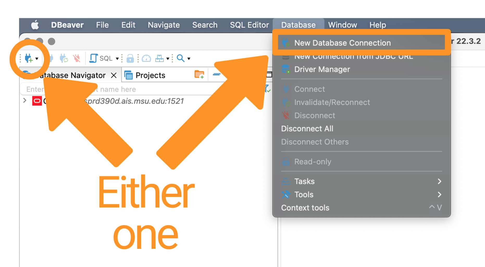

### FERPA Disclaimer Statement

> **IMPORTANT NOTE**: You are solely responsible for the maintenance of the confidentiality of this information as established in the Family Educational Rights and Privacy Act (FERPA) and Michigan State University Guidelines Governing Privacy and Release of Student Records.

***

## Background

Within each database is a collection of schema that contain tables and views. You are assigned a role for accessing specific segments of a schema and associated tables and views.

How to Request Access to a System or Application through MSU Information Technology
https://tdx.msu.edu/TDClient/32/Portal/KB/ArticleDet?ID=791

### Available Databases

 - MSUEDW: Production EDW with SISCS
 - MSUEDWQ: Quality Assurance (QA) database
 - MSUEDWR: frozen snapshot
 - MSUEDWRQ: frozen snapshot quality assurance (QA)
 
### Available Roles
FINREADERS_BASE
FINREADERS_OOI
SISCS_READERS

SISCS_ACADRECORDS_LEVEL3
SISCS_ADMISSIONS_SNSTV
SISCS_STDNT_FIN_SNSTV
SISCS_FINAID_SNSTV

ADMANALYT_READERS
ADMANALYT_SNSTV_READERS

## Description of Requested Access

```
Hi
In an attempt to better understand the research and results of the Deloitte Project, we are requesting access to all data/tables/views within the ADMANALYT schema that is part of the MSUEDW via the roles ADMANALYT_READERS and ADMANALYT_SNSTV_READERS. Access to this data allows us to evaluate the previous work done and learn how the work was performed. Previously, Kristin "Kris" Schuette handled this request but indicated they were not familiar with the ADMANALYT schema and, thus, could not adequately evaluate our request.  

database: MSUEDW
schema: SchemaName
roles: ADMANALYT_READERS and ADMANALYT_SNSTV_READERS  Please let me know if you have any questions regarding our access to this data.  

Thank you
Emilio
```


## Business Need/Comment

```
The users (_**List the MSU NetIDs**_) work for _**Supervisor's Name**_, the _Supervisor's Title and Unit**_. The noted users are performing exploratory analysis and developing predictive analytics models. The work products will assist the Enrollment Services offices in developing a better understanding of the students interested in attending MSU, learning why students choose to attend MSU, identifying essential factors related to their course outcomes and success at MSU, and developing bespoke gift and financial aid models. They need access to the noted resources to fulfill this role.

Access to _**schema name**_ allows us to _**add your reason here**_. 
```


## Download & Install

 - Visit [https://dbeaver.io](https://dbeaver.io) and click the "Download" button.
 - Install dBeaver following the instructions at [https://dbeaver.io/download/](https://dbeaver.io/download/). For macOS users, in addition to the standard dmg files, there are [Brew Cask](https://formulae.brew.sh/cask/dbeaver-community) and [MacPorts](https://ports.macports.org/port/dbeaver-community/summary/) installation options.


## Setup dBeaver

Open dBeaver and start the process to create a new connection by clicking the **green plug with the plus sign** or clicking the **Database** menu heading and clicking **New Database Connection**.

{width=100%}

The **Connect to a database** window opens displaying the **Popular** database connection types. Click on the **Oracle** option and click the **Next >** button.

{width=100%}

Next, the panel to enter the information to connect to the MSUEDW opens.

{width=100%}

Enter the following information:

  - Set **Host** as: ebsprd390d.ais.msu.edu
  - Set **Database** as: MSUEDW.EBSP.MSU.EDU
  - Ensure the **Port** is set to: 1521 (should already be populated)
  - Ensure the **Authentication** type is: "Oracle Database Native"
  - Enter your **Username**: your MSU NetID
  - Enter your **Password** that was sent to you from MSU Data Services. Search your email for an email from dataservices AT msu DOT edu. 
  
Alternatively, they might have sent you a TSN Names file (`tnsnames.ora`) via File Depot. Save the TSN Names file to OneDrive so it is easily accessible.

Click the **Finish** button to complete the setup.

## Available Enterprise Data Warehouses (EDWs)

There are a collection of Enterprise Data Warehouses available. The following table contains their specific information.

|                    | MSUEDW                 | MSUEDWQ | MSUEDWR | MSUEDWRQ |
|---|---|---|---|---|
| **Description**    | Production EDW with SISCS | quality assurance database | frozen snapshot | frozen snapshot quality assurance |
| **Host**           | ebsprd390d.ais.msu.edu | ebsqa390d.ais.msu.edu | ebsprd390d.ais.msu.edu | ebsqa390d.ais.msu.edu |
| **Database**       | MSUEDW.EBSP.MSU.EDU    | MSUEDWQ.EBSP.MSU.EDU | MSUEDWR.EBSP.MSU.EDU | MSUEDWRQ.EBSP.MSU.EDU |
| **Port**           | 1521                   | 1521 | 1521 | 1521 |


## Navigate the MSUEDW via dBeaver

Once connected to the MSUEDW, 

  - Click the **>** next to **ORCL** to view the available options. 
  - Click the **>** next to **Schemas** to view all schemas attached to the MSUEDW. 
  - Scroll down to **SISCS** (the Campus Solutions implementation of the Student Information System) and click the **>** to see all available Tables (sometimes called Views). 
  - Click on a Table to see the data contained within.

{width=100%}
