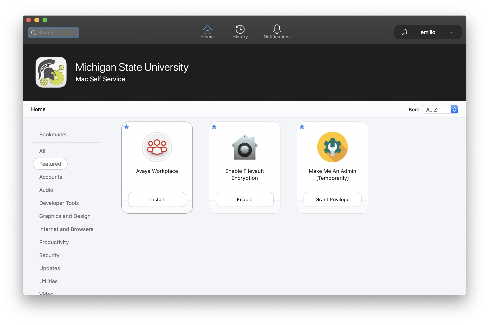
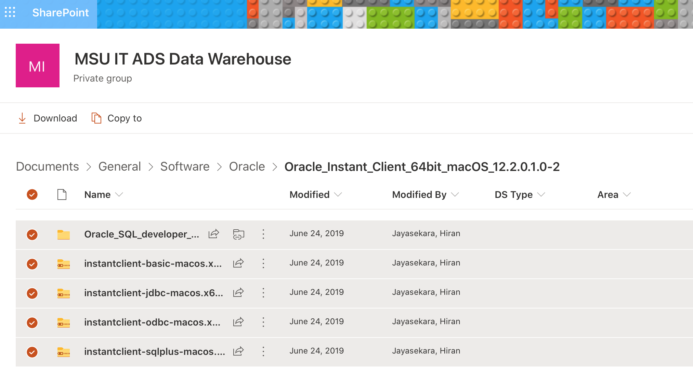
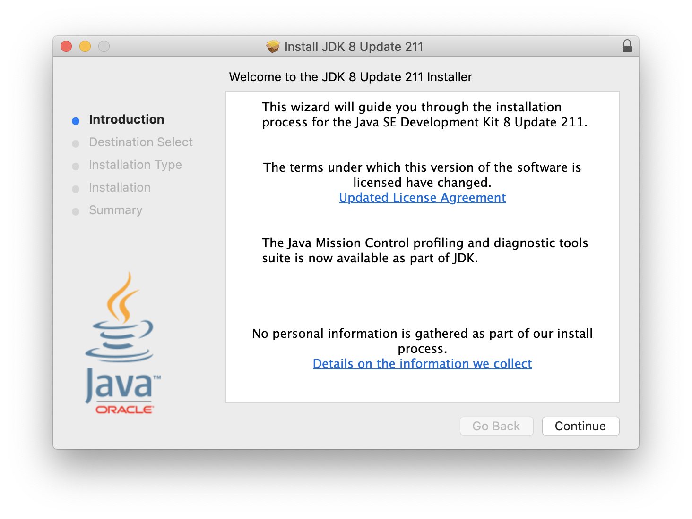
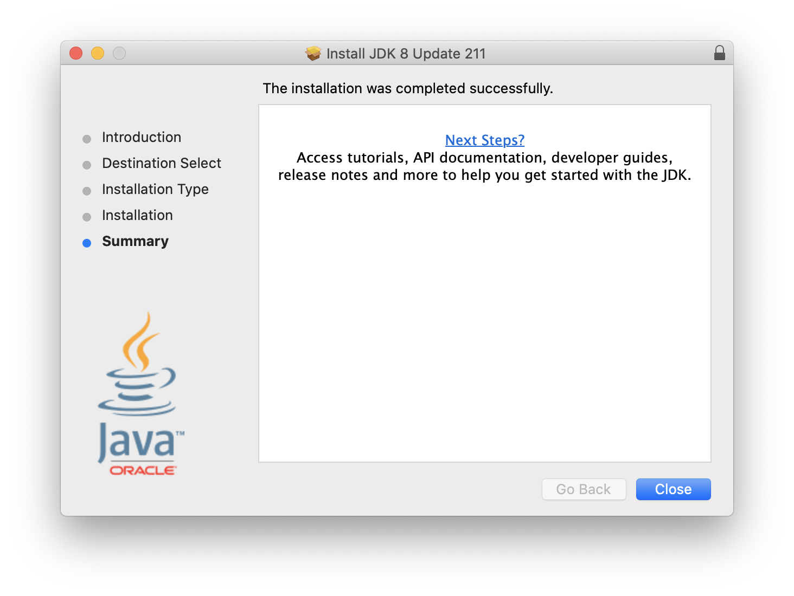
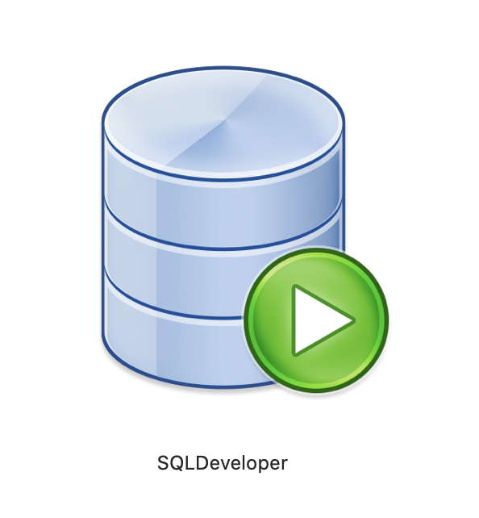
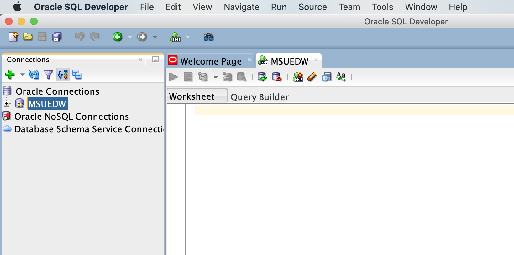
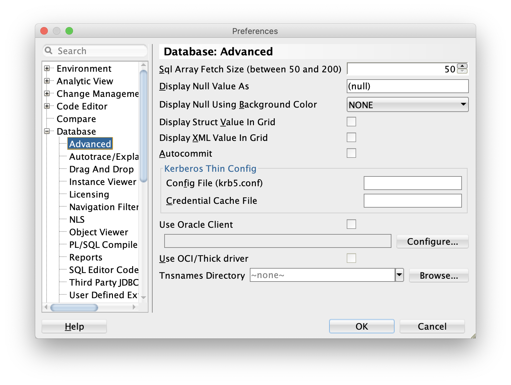
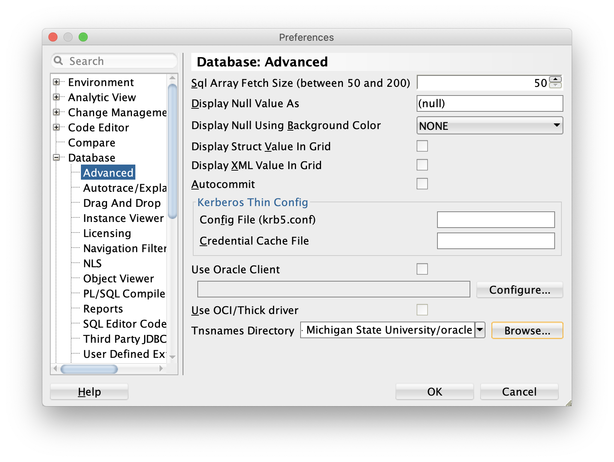

Make sure you open the _Self Service_ and login with your MSU NetID. You will need to click the "Make Me An Admin (Temporarily)" tile to grant yourself privileges before each change (installing the Java Development Kit and copying the Oracle SQL Developer application to the `Applications` folder) to your Mac. 



## Download SQL Developer 20.4.1

https://www.oracle.com/tools/downloads/sqldev-downloads.html

Current version -- when writing this document -- is Version 20.4.1.407.0006 released on February 22, 2021.

Click on this link [https://michiganstate.sharepoint.com/:f:/s/MSUITADSDataWarehouse/EtWvFUpo3jRKsKsqArJHh1IBn_l5s9FTi0WBTG8JazLiEw?e=fzRQFU](https://michiganstate.sharepoint.com/:f:/s/MSUITADSDataWarehouse/EtWvFUpo3jRKsKsqArJHh1IBn_l5s9FTi0WBTG8JazLiEw?e=fzRQFU) and download all available files (you might not need them all, but why need to go back?).




## Install Instant Client 12.2

- Open the `Terminal` application
- In your home directory create a `~/software` directory (commonly called a folder) if it already does not exist. Add an `oracle` directory within `software`. (NB: single command to create both directories `mkdir -p ~/software/oracle`)

```
cd
mkdir software
cd ~/software
mkdir oracle
```

- Move (or copy) `instantclient-basic-macos.x64-12.2.0.1.0-2.zip` from `~/Downloads` to `~/software/oracle`

```
mv ~/Downloads/OneDrive_1_1-22-2021/* ~/software/oracle
```

- Unzip `instantclient-basic-macos.x64-12.2.0.1.0-2.zip`. When unzipped, the required symbolic links are automatically created.

```
unzip instantclient-basic-macos.x64-12.2.0.1.0-2.zip
  inflating: instantclient_12_2/BASIC_README  
  inflating: instantclient_12_2/adrci  
  inflating: instantclient_12_2/genezi  
    linking: instantclient_12_2/libclntsh.dylib  -> libclntsh.dylib.12.1 
  inflating: instantclient_12_2/libclntsh.dylib.12.1  
  inflating: instantclient_12_2/libclntshcore.dylib.12.1  
  inflating: instantclient_12_2/libnnz12.dylib  
    linking: instantclient_12_2/libocci.dylib  -> libocci.dylib.12.1 
  inflating: instantclient_12_2/libocci.dylib.12.1  
  inflating: instantclient_12_2/libociei.dylib  
  inflating: instantclient_12_2/libocijdbc12.dylib  
  inflating: instantclient_12_2/libons.dylib  
  inflating: instantclient_12_2/liboramysql12.dylib  
  inflating: instantclient_12_2/ojdbc8.jar  
  inflating: instantclient_12_2/uidrvci  
  inflating: instantclient_12_2/xstreams.jar  
finishing deferred symbolic links:
  instantclient_12_2/libclntsh.dylib -> libclntsh.dylib.12.1
  instantclient_12_2/libocci.dylib -> libocci.dylib.12.1
```

- Rename the `instantclient_12_2` directory to `lib` and delete the `instantclient-basic-macos.x64-12.2.0.1.0-2.zip` file.

```
mv instantclient_12_2 lib
rm instantclient-basic-macos.x64-12.2.0.1.0-2.zip
```

- Download and move your `tnsnames.ora` file to `~/software/oracle/lib`

```
mv ~/Downloads/tnsnames.ora ~/software/oracle/lib
```


## Install the Java Development Kit (JDK)

Oracle SQL Developer 12c _**requires**_ an older version of the JDK. Specifically, the one obtained through the MSU Sharepoint download above. _**You can have multiple JDKs installed.**_ There are multiple JDKs installed on my Mac.

```
emilio@MacBook ~ % ls -lthr /Library/Java/JavaVirtualMachines
total 0
drwxr-xr-x  3 root  wheel    96B Jan 21 11:17 jdk-11.0.10.jdk
drwxr-xr-x  3 root  wheel    96B Jan 22 13:07 jdk-15.0.2.jdk
drwxr-xr-x  3 root  wheel    96B Jan 22 13:20 jdk1.8.0_211.jdk
```

- In the folder, double click the `jdk-8u211-macosx-x64.dmg` file.
- The standard macOS install process will start. You will need to enter you password to complete the install. If your name is not auto-populated, grant yourself privileges again and try again.


**JDK 8 update 211 install start window** | **JDK 8 update 211 install complete window**
:-------------------------:|:-------------------------:
  |  


## Install Oracle SQL Developer

- Double-click the `sqldeveloper-19.1.0.094.2042-macosx.app.zip` file to unzip the Oracle SQL Developer application.
- In Self Service, grant yourself privileges.
- Drag the SQLDeveloper application to the `Applications` folder.
- Enter your password. If your name is not auto-populated, grant yourself privileges via Self Service (again) and drag-and-drop the SQLDeveloper application again.


## Connecting Oracle SQL Developer to MSUEDW

- Navigate to the `Applications` folder and double-click the SQLDeveloper icon to open it.

{width=10%} 


**SQLDeveloper Preferences panel** | **SQLDeveloper Preferences panel**
:-------------------------:|:-------------------------:
  |  


 
## Accessing MSUEDW Data using `R`

While the Oracle SQL Developer is a nice application for exploring the available data, why use two applications to access and analyze data?

- Install several SQL-specific R packages.

```
install.packages("DBI", "rJava", "RJDBC", "keyring", "tidyverse")
```

The `DBI`, `rJAVA`, and `RJDBC` packages allow `R` to connect to the Oracle database,
while `keyring` safely stores your password. The `tidyverse` is the g

 
 
```
options(java.parameters = c("-XX:+UseConcMarkSweepGC", "-Xmx8192m"))

library(DBI)
library(rJava)
library(RJDBC)
library(keyring)
library(tidyverse)

# Sys.setenv(JAVA_HOME="/System/Library/Frameworks/JavaVM.framework/Versions/Current/Commands")

## setup keyring ----
key_set(service="MSUEDW", username="EMILIO")


## Create connection driver ----
# get JAVA drivers from https://www.oracle.com/database/technologies/jdbc-drivers-12c-downloads.html
jdbcDriver <- RJDBC::JDBC(driverClass="oracle.jdbc.OracleDriver", 
                          classPath="/Users/emilio/software/OJDBC-Full/ojdbc6.jar")


## Create connection details for MSUEDW (details are found in tnsnames.ora) ----
# Connection format is:
# jdbcConnection <- dbConnect(jdbcDriver, "jdbc:oracle:thin:@//database.hostname.com:port/service_name_or_sid", "username", "password")
# I get this looking at the tnsnames.ora 

MSUEDW.connection <- RJDBC::dbConnect(jdbcDriver, 
                                      "jdbc:oracle:thin:@//ebsprd390d.ais.msu.edu:1521/MSUEDW.EBSP.MSU.EDU",
                                      "EMILIO", 
                                      key_get("MSUEDW","EMILIO"))

## construct the SQL query ----
sql.query <- "select *
 from siscs.c_class_tbl_v
 where rownum <= 10"

## send query and fetch the results ----
query.results <- dbSendQuery(MSUEDW.connection, sql.query)
query.data <- dbFetch(query.results)
query.data

## close connection ----
dbDisconnect(MSUEDW.connection)

```
