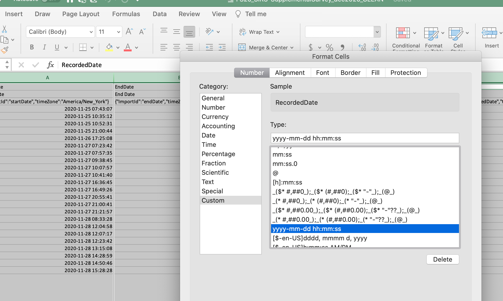
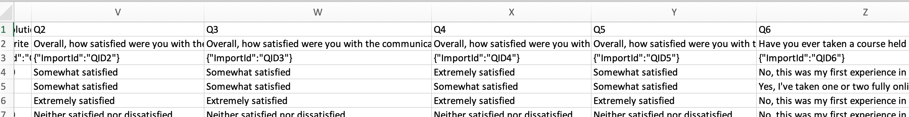

The following are the generalized steps to clean the survey data from Qualtrics. 
The resulting, de-identified and cleaned data is provided for the `theHUB`'s vignettes.

### Preparing the Data

The data likely is from Qualtrics [http://qualtrics.msu.edu/](http://qualtrics.msu.edu/) and the 
formatting of the dates and text responses need additional cleaning pre or post importing to your 
analysis software. An Excel workbook is used because it provides an simple way to manipulate the 
data into the needed formats.

Constructing an initial version of the cleaned survey data in an Excel
workbook provides a portable and easy to maintain dataset. The `openxlsx` package 
(CRAN: [https://cran.r-project.org/package=openxlsx](https://cran.r-project.org/package=openxlsx),
GitHub: [https://ycphs.github.io/openxlsx/index.html](https://ycphs.github.io/openxlsx/index.html))
provides a simple method for importing Excel workbooks into `R` without Java. While
Excel workbook + `openxlsx` method removes the need to fix CSV files with awkward
carriage returns (`\n`) tabs (`\t`) introduced by the respondent, some CSV files
are needed as noted below to allow you to explicity dictate the type of data contained
within each column.

The following command will import the `FS20_SIRS_SuppSurvey_CLEAN` tab into `R`
and an attempt will be made to identify dates and treat them appropriately.

```{}
fs20.results.xlsx <- openxlsx::read.xlsx(xlsxFile="./DATA/FS20_SIRS-SupplementalSurvey_dec2020_CLEAN.xlsx",
                                         detectDates=TRUE,
                                         sheet="FS20_SIRS_SuppSurvey_CLEAN")
```

### The Directory/Folder Structure and File Naming Scheme

The following directory (aka folder) structure is intended to make storing and 
finding your data and results easy. Having a common and consistent directory 
structure and file naming scheme makes it easy to revisit your work later.

Within my home directory, I have a `surveys` directory. For each survey, a new
directory (folder) is constructed. The `FS20_SIRSsupplemental` directory is for
the analysis of the Fall Semester 2020 (FS20) SIRES Supplemental Survey results.
Within this directory, the `DATA` and `images` directories are constructed to 
store the survey data and constructed plots.


Notice the `R` (analysis script, aka code) and `RData` (stored data) file names. 
Each file name starts with `0#` to allow
easy ordering/sorting of the files. The next part of the file name is the semester
the survey was administered (`FS20`) followed by the type of survey `SIRS-supplemental-survey`.
The last part of the file name is a _brief_ description of the actions performed
within the file, _e.g._, cleaning, SQL queries, and analysis. Notice that the
brief description is capitalized to distinguish it from the rest of the file name.


### The Excel Workbook

The _original_ Excel workbook typically has a single tab with the data exported 
from Qualtrics. After downloading the Excel workbook file, make a copy and rename
the file using the above file naming convention. In this case, the Excel workbook
was named `FS20_SIRS-SupplementalSurvey_dec2020_CLEAN.xlsx`. The month-year (`dec2020`)
indicates the month and year the survey closed. The `CLEAN` at the of the file
name indicates that the survey data contained within the Excel workbook has been
cleaned.

- Save a copy of the exported Excel workbook with the `_CLEAN` at the end of XLSX file.
- In Excel, make tabs for the following:
  - Add to the original tab, `_ORIG`
  - Copy the original tab to `XXX_CLEAN`
  - Create a new tab and name it `XXX_ENVIRO`
  - Create a new tab and name it `XXX_ColNames`


- Complete the following steps, saving the Excel workbook as you go. 
- Export the needed CSV files (tabs `XXX_ENVIRO` and `XXX_ColNames`) once the 
  data preparation steps are complete. 


### The `XXX_CLEAN` Tab

- Change all date time columns (StartDate, EndDate, RecordedDate) from 
  the `11/25/2020 07:43:07` format to `2020-11-25 07:43:07`. 
  - Select the date columns
  - From the `Cell Format` drop-down, select `More Number Formats...`
  - Click `Custom` from the left column
  - In the `Type:` box enter `yyyy-mm-dd hh:mm:ss`



- Save the workbook.
- Notice that rows 1 and 2 (image below) have the question numbers (row 1) and the
  survey questions (row 2), while row 3 has the Qualtrics specific designation 
  between the provided question and the survey question. 



- Copy rows 1 and 2, and paste them them into rows 1 and 2 of the `XXX_ColNames`
  Tab.
- Delete rows 2 and 3. Row 2 is deleted because the question (specifically the 
  text) is not needed and can cause errors when importing the data into `R`.
- Save the workbook.


### The `XXX_ENVIRO` Tab

The `XXX_ENVIRO` tab is for the data about how and when the survey was completed. 
The analysis of this set of data is not needed, but provides information of when 
the survey was completed, the duration of participant interactions, the platform 
used to complete the survey, the physical location (based on latitude and 
longitude values) of completion, and if the survey was completed.

- Copy the environment related columns of the `XXX_CLEAN` tab and paste them into 
  the `XXX_ENVIRO` tab. The environment columns are typically the first column 
  (`StartDate`) to the column containing the screen resolution (`Q37_Resolution`).
- Save the workbook.
- Export the `XXX_ENVIRO` tab as a CSV file. 
- Close the Excel workbook ignoring all warnings.


